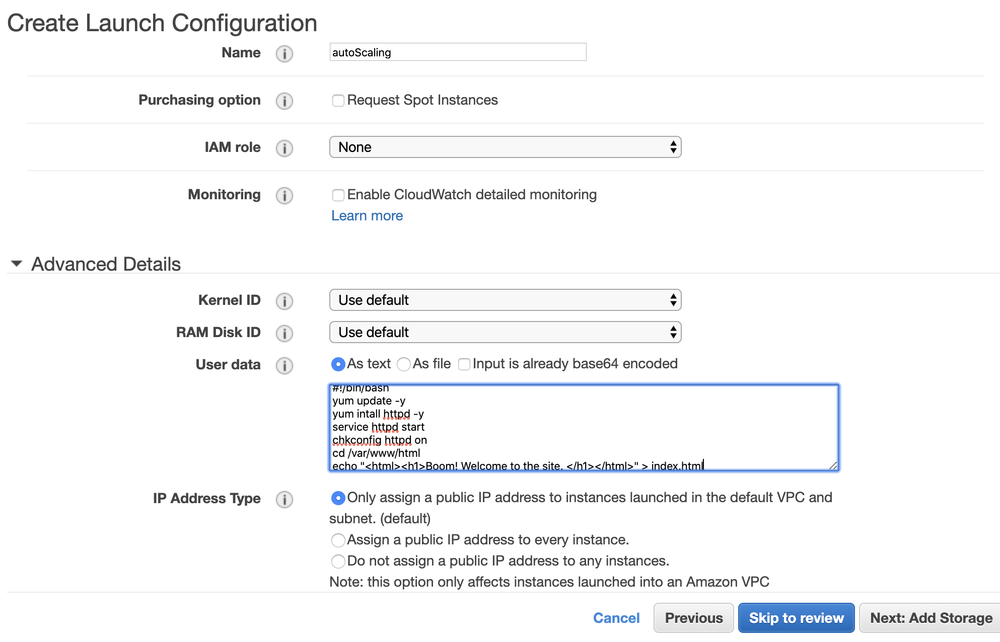
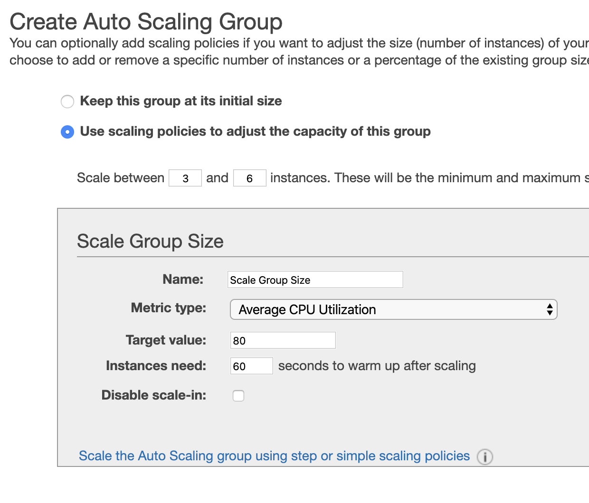

# Procedure for Auto Scaling Groups

## Procedure
1. Click 'Launch Configurations' under Auto Scaling on Left Margin.
2. Choose Amazon Linux 2 AMI, t2.micro.
3. Fill out form:
   

4. Use Existing Security Group: WebDMZ
5. Review and Create.

AutoScaling...
6. Click [Create an AutoScaling group using this launch configuration]
   1. Click *ALL* subnets.
   2. Start with 3 instances.
   3. Skip advanced settings there.
   4. Configure Scaling Properties.
   5. Could dd notification, not now.
   6. Tags: give it a name. 
   7. Create and look at Activity History.
   8. Go look at EC2 instances.
   9. Simulate failover by terminating an EC2 instance. 
   10. Should see that the autoscaling group detects failure and responds by creating new instances. 
   11. When finished, delete autoscaling group - instances will be terminated. 
   
   

<!-- CloudFormatiob Template -->
```yaml
myASG: 
  Type: AWS::AutoScaling::AutoScalingGroup
  Properties: 
    AvailabilityZones: 
      Fn::GetAZs: ""
    LaunchConfigurationName: 
      Ref: "myLaunchConfig"
    MinSize: "1"
    MaxSize: "4"
    LoadBalancerNames: 
      - Ref: "myLoadBalancer"
    MetricsCollection: 
      - Granularity: "1Minute"
        Metrics: 
          - "GroupMinSize"
          - "GroupMaxSize"
    Tags:
      - Key: Environment
        Value: Production
        PropagateAtLaunch: "true"
      - Key: Purpose
        Value: WebServerGroup
        PropagateAtLaunch: "false"
```