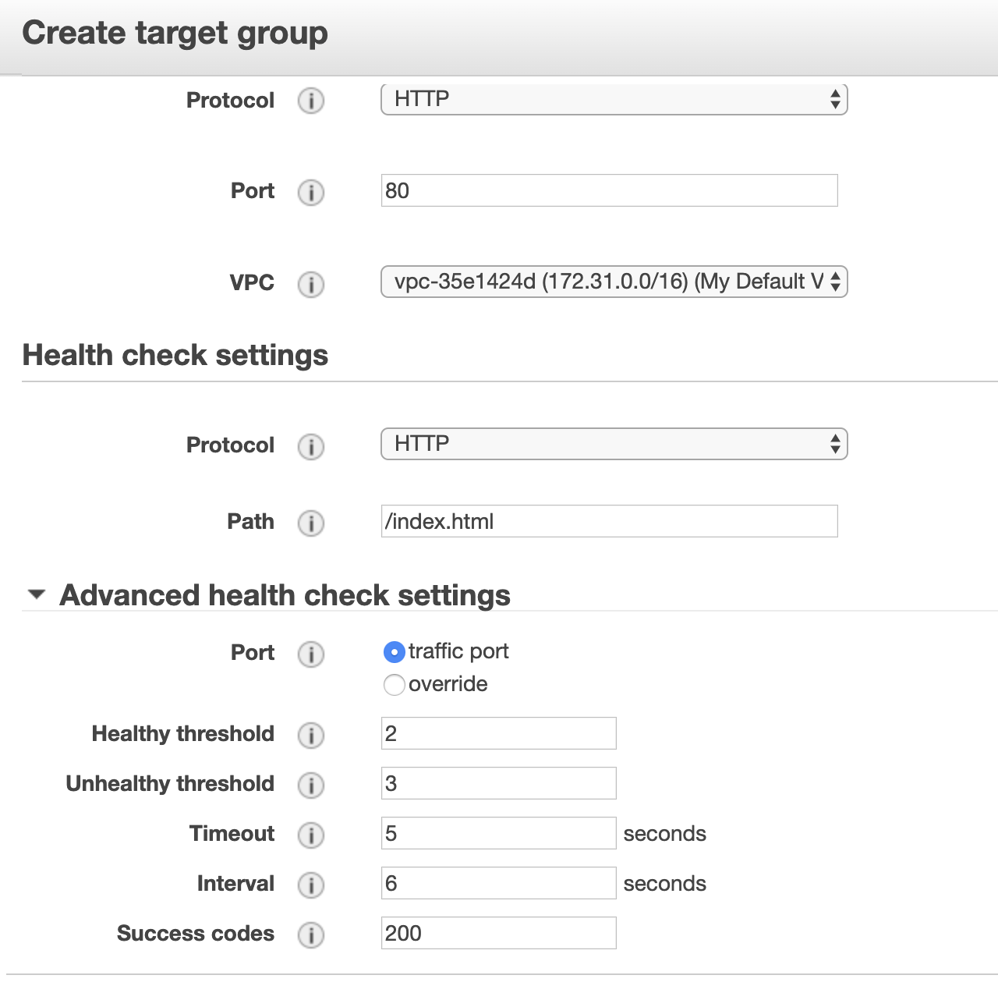
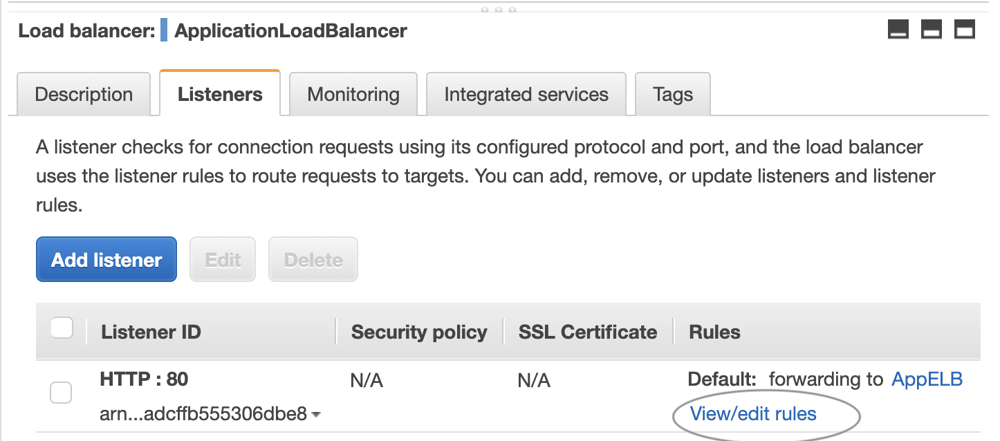

#Procedure for AWS Elastic Load Balancer (ELB)

## Overview
3 types:
Classic
Appication
Network

## Procedure for Classic Load Balancer!
1. Launch 2 EC2 Instances.
   1. One in AZ 2a
   2. Other in AZ 2b (separate AZ!)
   3. Setup Bootstrap script (User Data) for both (see Script 1.0)
   4. Add Name in Tag
   5. Use Web DMZ Security Group

Script 1.0
```
#!/bin/bash
yum update -y
yum install httpd -y
service httpd start
chkconfig httpd on
cd /var/www/html
echo "<html><h1>This is WebServer01</h1></html>" > index.html
```

2. Navigate to the EC2 public IP addresses to confirm success.
   
3. Create Classic Load Balancer.
   1. Name it
   2. Inside default VPC
   3. Can enable advanced VPC configs, but not now. 
   4. Listener configs, but not now, just leave as port 80
   5. Security Group - check WebDMZ group (Inbound rules allowing SSH and HTTP from 0.0.0.0/0 and ::/0)
   6. Configure health Check
      1. Response Timeout: 2 secs
      2. Interval: 5 secs
      3. Unhealthy threshold: 2
      4. Healthy: 3
   7. Click to add both EC2 instances.
   8. Create.
   
4. Make sure instances are 'In Service', then navigate to the DNS name in browser.
5. Refresh page and see sometimes WebServer01 and sometimes WebServer02.
6. If stop one of the EC2 intances, ELB knows and will not direct traffic to it. 

---

## Procedure for Application Load Balancer
1. Create a *Target Group*.
   
2. Click on [targets], [edit], select both EC2 instances, [save].
3. Create 'Application Load Balancer'
4. Check **ALL** availability zones.
5. Security Group: WebDMZ (previously created with inbound rules).
6. Associate with the created Target group (step 1):
   1. Choose existing.
   2. Choose the group created in step 1.
   3. Review and create.
7. Return to Target Group page, click [targets], select both EC2 instances, click [add to registered].
8. Look at target status...wait for it t go from 'initial' to 'healthy'.
9. Go back to Load Balancer and look at listener and rules:
    