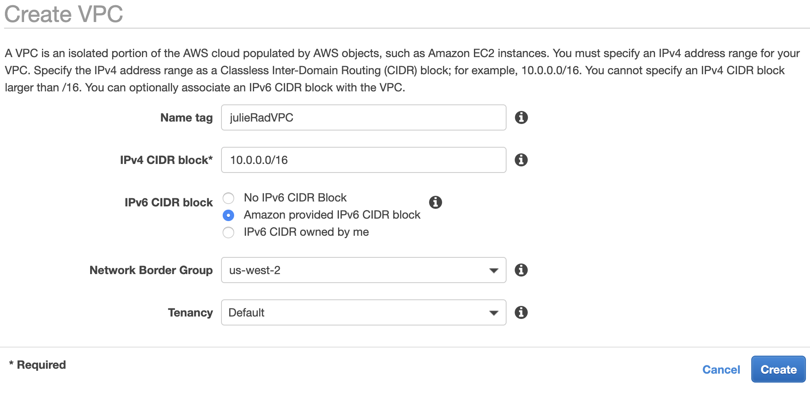
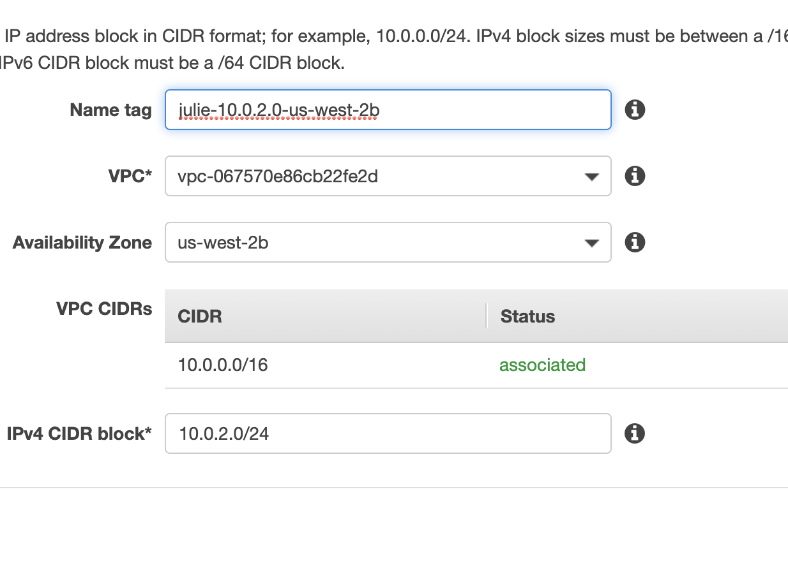
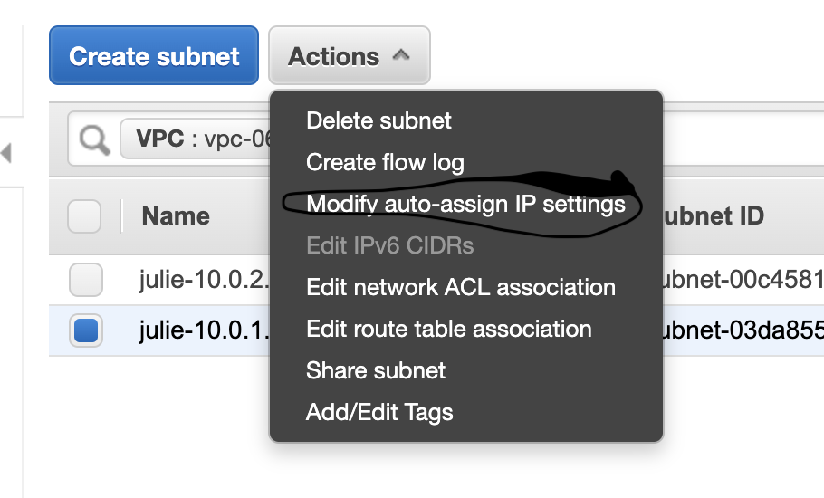

#Procedure for AWS VPC

## Overview

## Procedure

1. Choose correct region.
   
2. Create VPC.
   - Name
   - IPv4 CIDR block: 10.0.0.0/16
   - Click 'Amazon provided IPv6 CIDR block
   - Tenancy: Default.
   - By Default AWS creates Route Table, Network ACL, and Security Group.
   - In order to use, must create Subnets.

3. Create 2 subnets.
   - AZ 2a, Public, 10.0.1.0/24
   - AZ 2b, Private, 10.0.2.0/24

4. Make one of your subnets publically available (10.0.1.0).
   - Select chosen subnet.
   - Click 'actions', 'modify auto-assign IP settings'.
   - [x] Enable auto-assign public IPv4 address.
   - Save.
  

5. How do we get into this VPC? Create and Internet Gateway(IGW).
   - 'Click Internet Gateways', 'Create', name it, and create.
   - default is detached. Select your IGW, 'Actions', 'Attach to VPC'.

6. Configure routes in Route Table
   - 