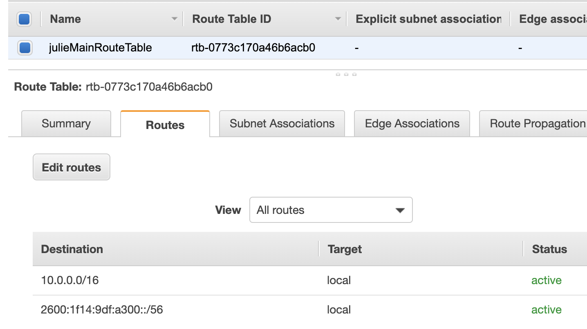
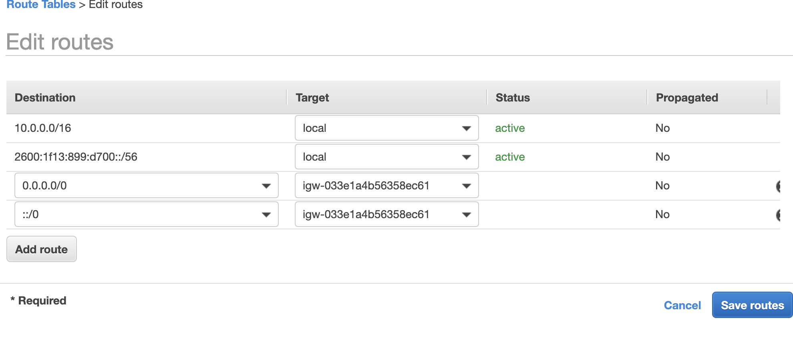
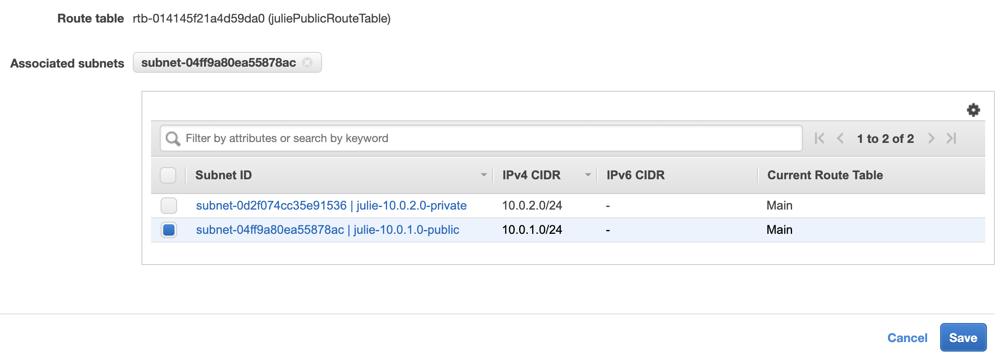

#Procedure for AWS VPC

## Overview

## Procedure

1. Choose correct region.
   
2. Create VPC.
   - Name
   - IPv4 CIDR block: 10.0.0.0/16
   - Click 'Amazon provided IPv6 CIDR block
   - Tenancy: Default.
   - By Default AWS creates Route Table, Network ACL, and Security Group.
   - In order to use, must create Subnets.

---

3. Create 2 subnets.
   - AZ 2a, Public, 10.0.1.0/24
   - AZ 2b, Private, 10.0.2.0/24

---

4. Make one of your subnets publically available (10.0.1.0).
   - Select chosen subnet.
   - Click 'actions', 'modify auto-assign IP settings'.
   - [x] Enable auto-assign public IPv4 address.
   - Save.
  

---

5. How do we get into this VPC? Create and Internet Gateway(IGW).
   - 'Click Internet Gateways', 'Create', name it, and create.
   - default is detached. Select your IGW, 'Actions', 'Attach to VPC'.

---

6. Configure routes in Route Table
   - Find your default route table, select it. 
   - You can see 2 Routes - your subnets can talk to one another. 
   - Keep your main routes private.

---

7. Create separate Route Table for Public subnets
   - 'Create route table', associate with VPC, name it.
   - In this Public Route Table, Click 'Routes', 'edit routes'
   - Add 2 more Routes and Target the IGW you created in Step 5.
     - 0.0.0.0/0
     - ::/0
   - In this same Public Route Table, click 'Subnet associations', 'Edit subnet associations'. We want to add 10.0.1.0 to our public route table. 
     - Select public subnet, save.

### Public Routes

### Subnet Association

---

8. Go to Private Route Table and see that our public subnet (10.0.1.0) is no longer associated with it. Only our private subnet is listed in Subnet Associations (10.0.2.0). We offically have a public and prvate subnet.
   
--- 

9.  Provision EC2 instances (one with private subnet, and one with public subnet). 
    - Click on 'EC2', 'launch instance', Amazon Linux 2 AMI, t2.micro.
    - Configure with your VPC and Public Subnet.
    - Tags -- Name: WebServer01
    - Configure Security Groups
      - Create a NEW Security Group
      - Name: WebDMZ
      - Description: WedDMZ
      - Add Rule
        - Add 5 Inbound Rules (see image below)
        - All ICMP - IPv4
        - HTTP
        - SSH
        - MySQL/Aurora
      - Review and Launch
      - Create a NEW Key Pair
        - Name: MyNewKP
        - Download
      - Launch